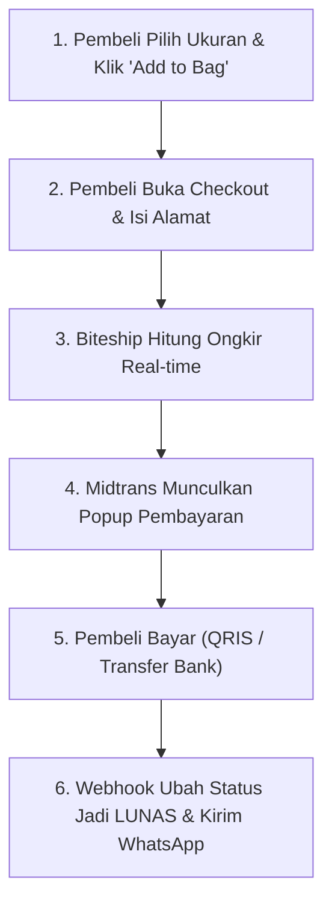

# DOKUMENTASI PROYEK MEMOEDJA WEB
*Panduan Lengkap, Sederhana, & Tanpa Overengineering*

Dokumen ini dibuat agar siapapun (bahkan tanpa latar belakang teknis yang mendalam) dapat memahami cara kerja website, alur pemesanan, dan cara pengaturannya di shared hosting cPanel.

---

## 1. Filosofi Kode: "Keep It Simple" (KISS)

Kami sengaja **tidak menggunakan** framework backend yang rumit (seperti Laravel, NestJS, atau Docker) karena target deployment adalah **Shared Hosting (cPanel)**.
* **Frontend**: React (Vite) + Tailwind CSS — Fokus pada visual mewah dan cepat.
* **Backend**: PHP 8.x Native — Kode PHP sederhana, bersih, mudah dibaca, dan langsung jalan di semua hosting Indonesia tanpa install apa-apa.
* **Database**: MySQL standar (dikelola lewat phpMyAdmin di cPanel).

---

## 2. Peta Folder & File Penting

Agar tidak pusing mencari kode, berikut fungsi setiap folder:

```
memoedja-web/
│
├── src/                          <-- TAMPILAN WEBSITE (FRONTEND)
│   ├── App.jsx                   <-- Halaman utama (merakit semua komponen)
│   ├── data/products.js          <-- Daftar 5 garmen, harga, foto, & stok
│   └── components/
│       ├── Navbar.jsx            <-- Header atas (Menu, Logo, Keranjang)
│       ├── HeroCampaign.jsx      <-- Foto utama layar penuh
│       ├── BoutiqueGallery.jsx   <-- Galeri foto garmen (klik untuk detail)
│       ├── ProductDetailModal.jsx<-- Popup detail baju, pilih size, add to bag
│       ├── CartDrawer.jsx        <-- Keranjang belanja yang geser dari kanan
│       └── CheckoutModal.jsx     <-- Formulir alamat, kurir, & tombol bayar
│
├── api/                          <-- JEMBATAN KE BITESHIP & MIDTRANS (BACKEND PHP)
│   ├── config.php                <-- Tempat isi API Key (rahasia, jangan disebar)
│   ├── db.php                    <-- Kode 15 baris untuk konek ke MySQL
│   ├── shipping/
│   │   ├── areas.php             <-- Minta daftar kecamatan ke Biteship
│   │   └── rates.php             <-- Minta harga ongkir kurir ke Biteship
│   ├── payment/
│   │   ├── token.php             <-- Minta popup pembayaran ke Midtrans
│   │   └── webhook.php           <-- Menerima kabar dari Midtrans saat pembeli lunas
│   └── services/
│       └── whatsapp.php          <-- Mengirim WA otomatis ke pembeli
│
├── .htaccess                     <-- Pengatur jalan di cPanel (biar React & PHP akur)
├── DEPLOY_CPANEL.md              <-- Panduan 3 langkah auto-deploy dari GitHub
└── database.sql                  <-- File SQL untuk buat tabel di phpMyAdmin
```

---

## 3. Alur Transaksi (Dari Klik Sampai Baju Dikirim)

Semua proses pembelian berjalan dalam 4 langkah sederhana:



1. **Pilih Baju**: Pembeli klik foto garmen $\rightarrow$ pilih ukuran (28–36 / S–XL) $\rightarrow$ masuk keranjang.
2. **Ketik Alamat**: Pembeli mengetik nama kecamatan (misal: "Kebayoran Baru"). Sistem memanggil `api/shipping/areas.php` untuk menampilkan saran wilayah.
3. **Pilih Ongkir**: Begitu wilayah dipilih, `api/shipping/rates.php` menanyakan ongkir ke Biteship. Muncul pilihan kurir (JNE Reguler, SiCepat, J&T) beserta tarif dan estimasi harinya.
4. **Bayar**: Pembeli klik tombol "Bayar". Sistem memanggil `api/payment/token.php`, lalu jendela resmi Midtrans Snap muncul langsung di layar pembeli (bisa scan QRIS GoPay/BCA atau transfer Virtual Account).
5. **Otomasi Selesai**: Saat pembeli selesai transfer, server Midtrans mengirim sinyal ke `api/payment/webhook.php`. Pesanan otomatis berubah jadi **PAID** dan WhatsApp konfirmasi langsung terkirim ke HP pembeli.

---

## 4. Cara Pengaturan di Shared Hosting cPanel

Jika Anda sudah punya akun hosting (misal di Niagahoster, DomaiNesia, Hostinger, atau Rumahweb):

### Langkah A: Buat Database di cPanel
1. Masuk ke cPanel $\rightarrow$ cari menu **MySQL Databases**.
2. Buat database baru (misal: `memoedja_db`) dan buat user database.
3. Sambungkan user ke database dengan hak akses *All Privileges*.
4. Buka **phpMyAdmin** $\rightarrow$ klik database tersebut $\rightarrow$ klik tab **Import** $\rightarrow$ pilih berkas `database.sql` $\rightarrow$ klik **Go**.

### Langkah B: Atur API Key di `api/config.php`
Di File Manager cPanel, buka folder `public_html/api/`, buat salinan `config.example.php` menjadi `config.php`, lalu isi:
```php
// Database MySQL
define('DB_HOST', 'localhost');
define('DB_NAME', 'nama_database_anda');
define('DB_USER', 'user_database_anda');
define('DB_PASS', 'password_database_anda');

// API Biteship (ambil dari dashboard.biteship.com)
define('BITESHIP_API_KEY', 'biteship_test.xxxxxx');

// API Midtrans (ambil dari dashboard.midtrans.com)
define('MIDTRANS_SERVER_KEY', 'SB-Mid-server-xxxxxx');
define('MIDTRANS_CLIENT_KEY', 'SB-Mid-client-xxxxxx');
define('MIDTRANS_IS_PRODUCTION', false); // Ubah ke true saat siap jualan asli
```

### Langkah C: Pasang Auto-Deploy dari GitHub (Opsional)
Ikuti panduan di [DEPLOY_CPANEL.md](DEPLOY_CPANEL.md). Setelah 3 variabel FTP diisi di GitHub, setiap kali Anda push kode, website di cPanel akan langsung terupdate otomatis.

---

## 5. Cara Uji Coba Tanpa Uang Asli (Mode Sandbox)

Anda bisa menguji seluruh alur belanja secara gratis menggunakan mode testing:

1. **Testing Midtrans**:
   * Gunakan Simulator Resmi Midtrans: [simulator.sandbox.midtrans.com](https://simulator.sandbox.midtrans.com)
   * Saat popup pembayaran muncul dan Anda memilih BCA Virtual Account, masukkan nomor VA tersebut ke simulator Midtrans dan klik "Bayar". Pembayaran akan langsung dianggap lunas!
2. **Testing Biteship**:
   * API Key berawalan `biteship_test.` sudah menyediakan tarif simulasi gratis untuk seluruh rute Indonesia tanpa memotong saldo.
3. **Testing WhatsApp**:
   * Jika belum punya token WhatsApp Gateway, sistem masuk ke mode simulasi. Pesan tidak terkirim ke HP asli tetapi dicatat rapi di berkas `api/logs/whatsapp.log`.

---

## 6. Pertanyaan Umum (FAQ)

**T: Apakah foto-foto produk bisa diubah tanpa edit kode rumit?**  
J: Sangat bisa. Cukup buka berkas `src/data/products.js`. Di sana sudah tertulis rapi nama baju, harga, ukuran, dan link foto Unsplash/hosting Anda.

**T: Bagaimana jika ada hacker yang mencoba manipulasi harga?**  
J: Aman. Backend PHP tidak pernah mempercayai angka harga yang dikirim dari browser. Backend selalu menghitung ulang total harga berdasarkan data resmi sebelum meminta pembayaran ke Midtrans.

**T: Jika kuota hosting saya kecil, apakah website ini berat?**  
J: Tidak. Frontend dikompilasi menjadi berkas statis super ringan (~300 KB), dan backend PHP hanya berjalan sepersekian detik saat pembeli mengecek ongkir atau menekan tombol bayar.
